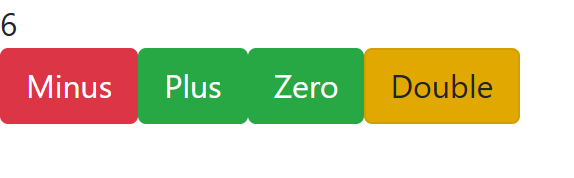

# React + Redux counter (2019)

**[▶ Live demo](https://dimitriuses.github.io/React-Redux/)**

[](https://github.com/Dimitriuses/React-Redux/actions/workflows/pages.yml)


A counter wired through a Redux store — four actions (`INC`, `DEC`, `ZERO`, `DOUBLE`), one
reducer, one `connect()`ed component. Written over three mornings in October 2019 as a
first exercise in Redux, and kept as a record of that.

It is small on purpose and it is small in fact: the 2019 repository held **98 lines of
hand-written JavaScript across four files** (100 today). Everything else in it was Create
React App scaffolding — measured, not assumed: **10 of its 17 tracked files were
byte-identical to `react-scripts@3.1.2`'s own template.**



## Status

**It works.** It built and ran unmodified in 2026 on Node 22, and the 2026 pass here changed
no behaviour — see *What the tidy changed* below. Click Plus three times and Double, and you
get 6.

There is nothing clever in it, and that is the honest summary. It is the "hello world" of
Redux: a store holding a single number.

## History

Four commits, three consecutive mornings:

| Commit | When | Title |
|---|---|---|
| `712dc2f` | 2019-10-01 09:41 | `Initial commit from Create React App` |
| `85c0316` | 2019-10-01 11:50 | `first commit` |
| `2b83389` | 2019-10-02 11:50 | `para XXXB` |
| `8674fdc` | 2019-10-03 10:21 | `DZ upend` |

The interesting part is that the four commits are four different architectures, and each one
is still readable in the history:

- **`85c0316` — Redux with no React at all.** The entire CRA `index.js` is commented out and
  replaced by a bare `createStore`, two `document.getElementById(...).addEventListener`
  calls, and a `store.subscribe` handler writing `store.getState()` into `innerHTML`. The
  buttons lived in `public/index.html` as plain markup (`<h1 id="rez">`, `<button id="plus">`).
  This is where today's `plus` and `minus` ids come from — they were the wiring itself before
  React replaced it, which is also why nothing queries them any more.
- **`2b83389` — both at once.** React is added back without the DOM code being removed, so
  the file does its `getElementById` wiring *and* calls `ReactDOM.render(<App />)`. `App.js`
  imports a `Couter` component from a file that is **0 bytes**, and renders it. (A default
  import from an empty module is `undefined`, which React rejects as an element type — so
  this commit almost certainly did not run. I have not built it to confirm.)
- **`8674fdc` — the version you see.** The DOM code and the CRA demo page are deleted, the
  misspelled `Couter/` directory is abandoned, and the counter becomes a `connect()`ed
  component with action creators in their own file.

The leftover `<h1 id="rez">` markup from the first stage survived as a comment in
`public/index.html` until this pass removed it.

*(The commit titles read as course markers — "para" a lesson period, "DZ" homework — but
that is an inference from the words, not something recorded anywhere in the repository.)*

## How it works

```
src/
├── index.js                       store creation + <Provider>
├── Actions/Action.js              four action creators
├── Reducer/Reducer.js             the reducer
└── Components/Counter/Counter.js  the connected component
```

The store's entire state is **a number**, not an object — `mapStateToProps` reads
`counter: state` directly. `ZERO` and `DOUBLE` are written to take a payload, but the only
callers are in `mapDispatchToProps` and they hardcode `0` and `2`.

## Running it

Needs **Node 22** (see `.nvmrc`) and one environment variable. `react-scripts` 3.1.2 is
webpack 4, which hashes with md4; OpenSSL 3 removed md4, so **both** `npm start` and
`npm run build` fail with `ERR_OSSL_EVP_UNSUPPORTED` without it. Verified in both
directions — this is not carried over from another project's README:

```bash
npm ci

# bash
NODE_OPTIONS=--openssl-legacy-provider npm start     # http://localhost:3000
NODE_OPTIONS=--openssl-legacy-provider npm run build

# PowerShell
$env:NODE_OPTIONS = "--openssl-legacy-provider"; npm start
```

`npm ci` installs 1,447 packages on Node 22 with no native rebuild.

## What the tidy changed

The 2026 pass was a tidy, not a rewrite. Every number below was measured by driving both
builds through the same nine-checkpoint browser session:

| | 2019 | now |
|---|---|---|
| Build warnings | 1 (`initialState` assigned but never used) | **0** |
| Third-party hosts at runtime | 1 (`stackpath.bootstrapcdn.com`) | **0** |
| Unreachable files in `src/` | 3 (`logo.svg`, `serviceWorker.js`, `index.css`) | **0** |
| Misspelled paths | 2 (`Reduser/`, `couter.js`) | **0** |
| Visible behaviour | — | **9/9 checkpoints byte-identical, screenshots included** |

Bootstrap 4.3.1 was hotlinked from a CDN; it is now the same version as a local dependency,
which is why the screenshots still match pixel for pixel. The three deleted files were CRA
scaffolding that nothing imported — `index.css` included, which is why the 2019 production
build emitted no CSS file at all. The single remaining difference in the whole DOM dump is
one attribute: the Zero button's `id="null"` is now `id="zero"`.

Behaviour that was *left alone* is listed below rather than quietly fixed.

## Known limitations

- **No tests.** The CRA sample test was deleted in the last 2019 commit and nothing replaced
  it, so `npm test` exits 1 with *"No tests found"*. That is accurate, and it is left
  accurate.
- **Plus and Zero are both `btn-success`** — two buttons that do different things look
  identical, visible in the screenshot above. Kept as it shipped.
- **No layout.** No container, no centring; the number renders as body-sized text in the
  corner of the page. The exercise was the store, not the CSS.
- **The store is a bare number**, so there is nowhere to put a second piece of state without
  touching every `mapStateToProps`. The 2019 reducer opened with an unused
  `initialState = { counter: 0 }`, which is the shape that was intended and never built.
- **The actions are parameterised but nothing parameterises them** — `ZERO` always gets `0`
  and `DOUBLE` always gets `2`, both hardcoded at the dispatch site.
- **No persistence, no routing, no error handling.** Reloading resets to zero.
- **`react-scripts` 3.1.2 is long deprecated.** `npm audit` reports 225 advisory entries;
  **0 of them name a package that reaches the browser** (`react`, `react-dom`, `redux`,
  `react-redux`, `bootstrap`) — they are all build tooling. Note that `--omit=dev` is a
  no-op here, because CRA puts `react-scripts` in `dependencies`.
- **Redux here predates Redux Toolkit**, so it is far more verbose than an equivalent
  written today. That is period-typical rather than a defect.

## The original

The 2019 code is preserved unmodified at the **`v0.1-original`** tag:

```bash
git show v0.1-original:src/Reduser/Reduser.js
```

## Licence

[MIT](LICENSE).
